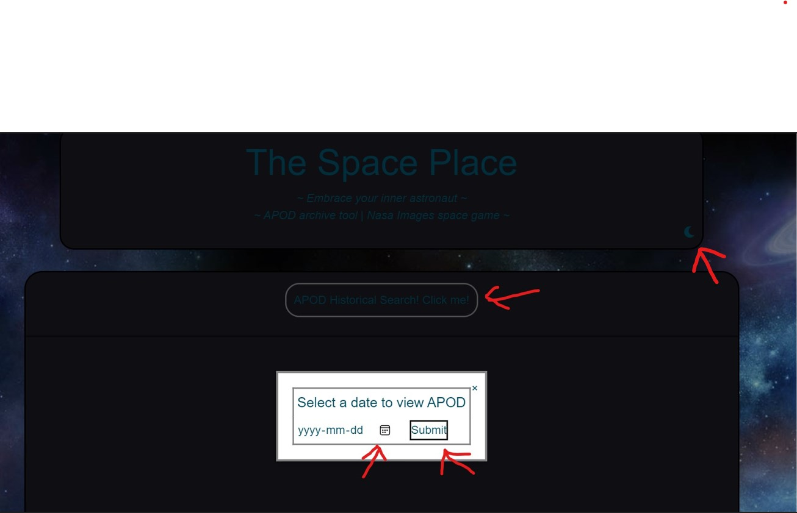
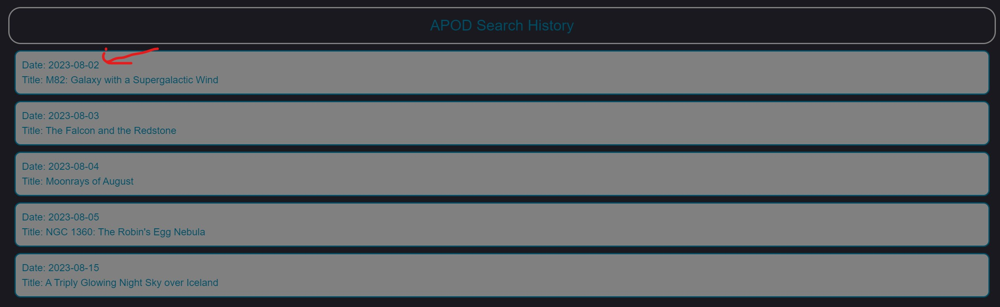

# The Space Place !
## *Your place to embrace space! Where your inner astronaut, comes out!*
---
## Features: Engaging & Responsive UI, search history for when you forget, light/dark mode toggle, apod search tool, NASA images word game, etc! 
--- 
## Technologies used.
- HTML
- CSS
- Tailwind CSS framework, GoogleFonts, FontAwesome.
- JavaScript
### Global
- Light/dark mode toggle.
### APOD (Astronomy Picture of the Day), archive search tool!
- Quickly search for any APOD, going as far back as 1995!
- Search by date to receive quick feedback including: 
- The APOD itself.
- The title for the given image.
- A description of the picture such as what it is, how it works, and NASA's understanding of the natural phenomena.
- A list of recent searches that persist when the page is refreshed.

### NASA Word game! Hangman, but better! For those who love space, or just think its cool, this game is for you! GLHF
- The game will display a random image from a set of predetermined NASA Image Library API queries.
- User will be presented with a short description of the image and a question.
- User can then attempt to guess the name of the celestial object in the photo.
- Once user has correctly guessed the word they can play again.
---
## usage 

- You can click on apod historical search, then on the calendar button to pick a date. After that you can submit it will show you an image and a description, you can click on the moon to switch it from light mode to darkmode and vice versa
- When you scroll down after you search you can click on your old searches to look back at them
- You click the button and it shows you a picture and you guess what the word is
### Links
- Repo: https://github.com/BenACooper/space-place-project
- Deployed: https://benacooper.github.io/space-place-project/

